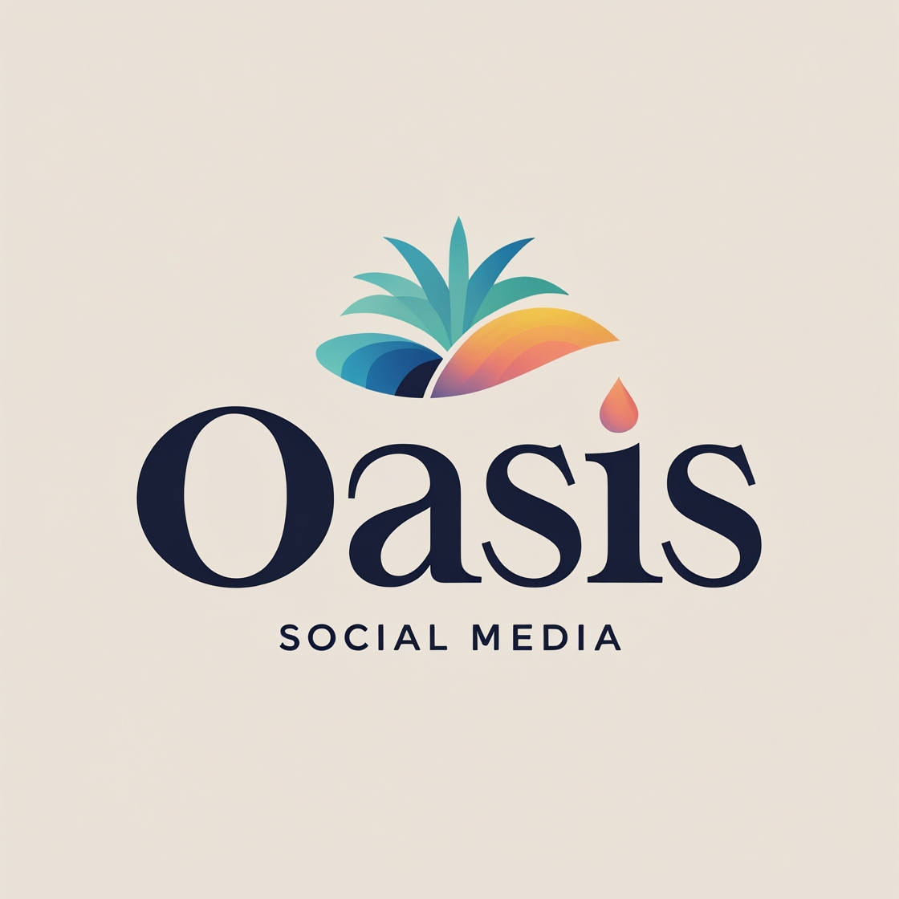

# **Logo Criada com Leonardo AI**

## 📒 Introdução
Este documento apresenta a logo criada utilizando a ferramenta **Leonardo AI**, uma Inteligência Artificial especializada em geração de imagens. A IA permite criar designs personalizados a partir de descrições textuais, tornando o processo de criação visual mais acessível e eficiente.

## 🖼️ Logo Criada
A imagem abaixo representa a identidade visual gerada com o **Leonardo AI**:

## 🎯 Conclusão
O **Leonardo AI** demonstrou ser uma ferramenta poderosa para a geração de imagens personalizadas, permitindo a criação de logos com qualidade profissional de forma rápida e intuitiva.

---